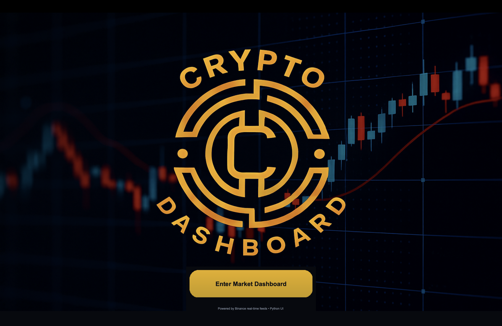
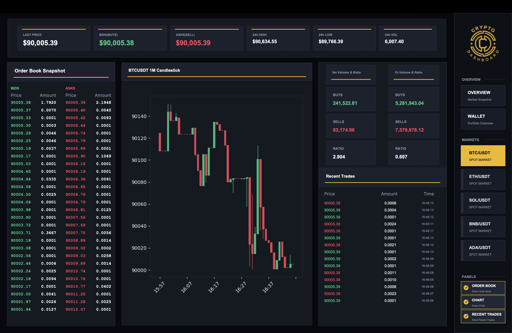
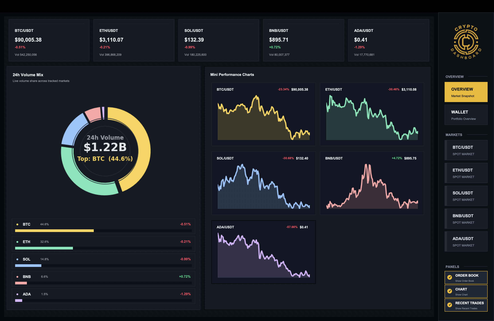
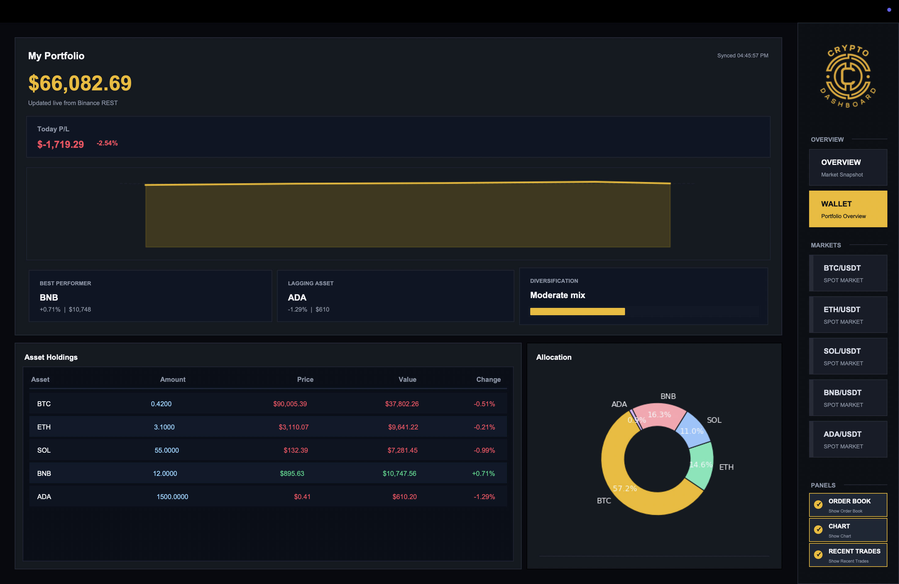

# Crypto Dashboard Pro

Desktop dashboard for monitoring crypto markets in real time. Tkinter provides the interface, Binance WebSockets stream the live data, and Matplotlib renders the charts.

## Features
- Home screen with branded artwork and a call-to-action button.
- Realtime overview cards with REST fallbacks every five seconds.
- Combined market rows that show ticker, order book, chart, and trade feed together.
- Sidebar for toggling panels, switching symbols, and storing preferences.
- Headless option that prints the latest 24h snapshot in the terminal.

## Example Screens
Take a quick look at how the desktop app is laid out. These screenshots live in `project_UI/` so you can swap in your own branding later.









## Tech Stack
- Python 3.10+
- Tkinter
- websocket-client with Binance Stream
- requests
- matplotlib, mplfinance, numpy, pandas
- Pillow

## Project Structure
```
main.py                  # Starts the app and builds the layout
components/
├─ home_screen.py        # Splash screen and CTA
├─ overview.py           # Realtime overview cards
├─ ticker.py             # Ticker header
├─ orderbook.py          # Order book display
├─ chart.py              # Candlestick chart
├─ trades_feed.py        # Recent trades list
├─ volume_stats.py       # Volume summary
└─ wallet.py             # Wallet view
config.py                # Symbols, colors, endpoints, preferences path
requirements.txt
```

## Install and Run
```bash
python3 -m venv .venv
source .venv/bin/activate            # Windows: .venv\Scripts\activate
pip3 install -r requirements.txt
python3 main.py
```
---
Created by **Thanutdit Jiravichalert (Student ID 6810545662)** for **Programming 1 (01219114-01219115)**.
